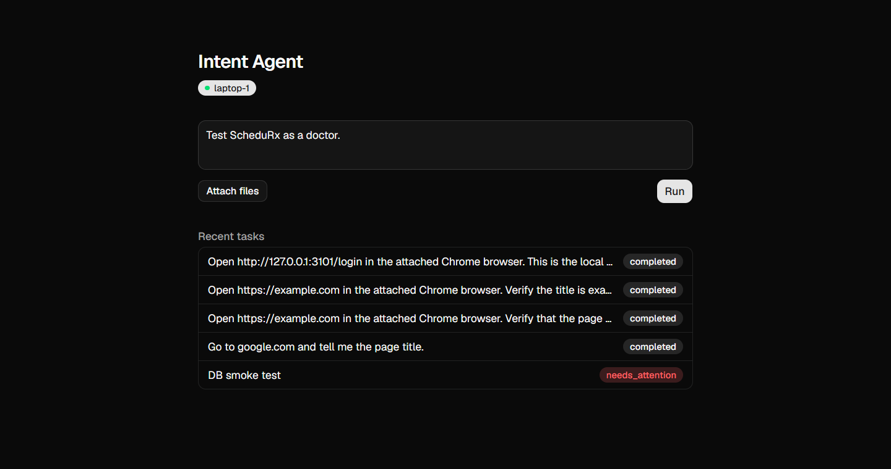
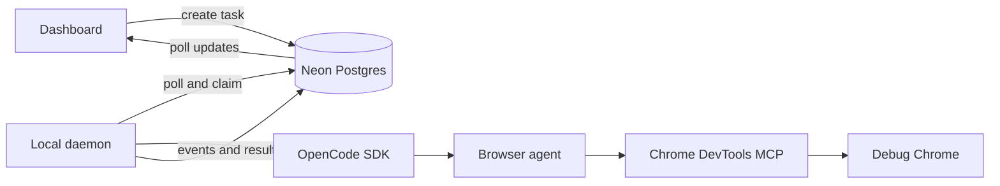
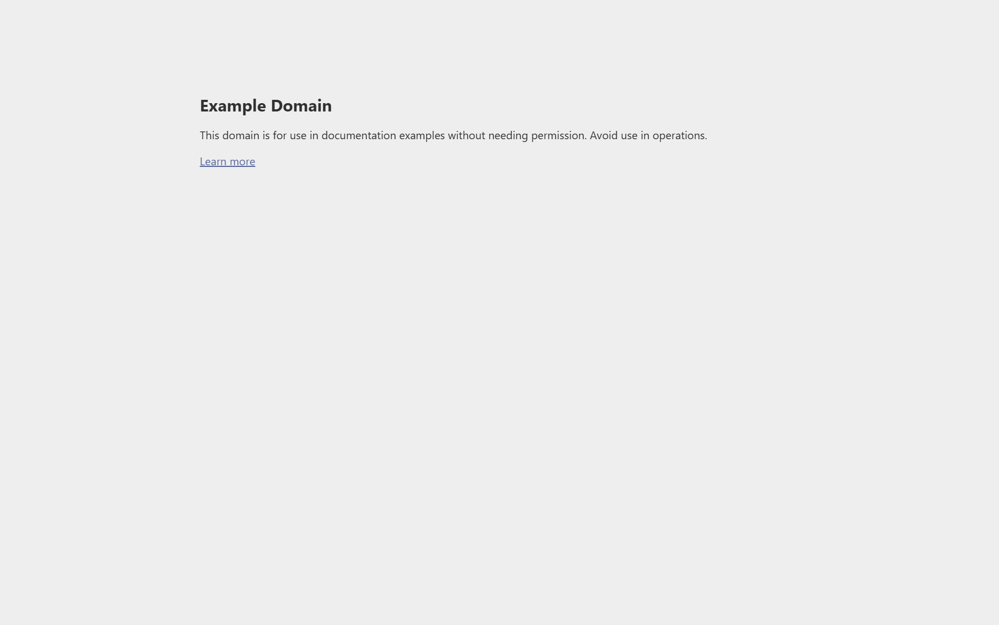

# Intent Agent

Intent Agent turns a natural-language request into a queued task that a daemon executes in a real Chrome browser. A Next.js dashboard stores tasks in Neon Postgres, the local daemon claims them, and an OpenCode browser agent drives Chrome through the Chrome DevTools MCP server. Each task returns a status, an ordered activity trail, and a final result to the dashboard.



## Demo


The animation above is a screen recording, shown at 3x speed, of the agent running a real task through the queue and daemon. It opens Google, types "Applied AI engineer jobs India", opens the top organic result and reads the job listings. The sign-in popup and profile picture in the recording are masked for privacy.

[Download the full 36-second demo video with sound](docs/demo/intent-agent-demo.mp4). Its dashboard and job-application scenes are recreations, and the application details in them are fictional.

## Features

| Feature | What it does |
| --- | --- |
| **Plain-English tasks** | Type what you want done ("search for Applied AI roles and open the top result") and it is queued from the dashboard, including from your phone once deployed. |
| **Your real, logged-in Chrome** | Tasks run in a Chrome you already use, so sites that need your sessions and cookies work without handing credentials to a third party. |
| **Activity trail** | Every run records status, tool actions, findings, and the final answer, and the dashboard shows the trail alongside the result. |
| **File attachments** | Attach files to a task, and the agent can upload local files (such as a resume) into web forms. |
| **Follow-up in the same session** | Continue a finished task and the agent keeps its earlier context instead of starting cold. |
| **Personal context** | Private Markdown files in `context/` (profile, preferences, file locations) are loaded into each new session, so the agent does not need to be told the same things twice. |
| **Stops when stuck** | On a CAPTCHA, OTP, login challenge, or input it cannot determine, the run ends as `needs_attention`, uploads a screenshot, and can email you. |
| **Consequence policy** | Browsing, reading, and filling in forms are automatic. Submitting, sending, paying, or deleting only happens when your task explicitly asks for it. |
| **Untrusted-page defense** | Text on web pages is treated as data, never as instructions, which limits prompt-injection from the sites the agent visits. |
| **Private by design** | The hosted app only stores tasks and results. Browser control stays on your machine, and access is gated by a shared secret. |

## Who it is for

| You are... | Typical use |
| --- | --- |
| **A job seeker** | Search roles, read postings, and fill application forms with your resume attached, stopping before Submit for your review. |
| **A developer or power user** | Delegate repetitive browser chores such as checking a dashboard, collecting details from several pages, or verifying a deployed page. |
| **Someone away from their computer** | Queue a task from your phone and let your home or work machine do it. |
| **An automation tinkerer** | Extend an agent with your own context files, models, and prompts. |

It is built for one person driving one machine, not for teams.

## When to use it

Use Intent Agent when:

- The task is a short, multi-step web workflow that a person would do in a browser: search, open, read, fill, upload.
- The site requires you to be logged in, or blocks headless scrapers.
- You want a record of what the agent did and the ability to step in when it is stuck.
- You are fine with the agent working on your machine while it is on and awake.

Reach for something else when:

- You need high-volume or scheduled scraping. Tasks run one at a time, so a purpose-built scraper or API will be faster and cheaper.
- A site offers an official API. An API is more reliable than driving a page.
- The action is irreversible and you have not reviewed it. The agent is designed to stop short, but you should still read what it did.
- Several people need separate accounts and permissions. Access is a single shared secret.
- The site's terms forbid automation. Check them before pointing the agent at it.

## Current limitations

- One task runs at a time on a device, and there is no batch or spreadsheet-driven mode yet.
- The activity trail is assembled after the model responds, with a 15-second heartbeat while it works, rather than streamed step by step.
- The agent's own screenshot call can time out on long-lived browser sessions; restarting the daemon clears it.
- Setup scripts assume Windows and a dedicated Chrome debug profile.
- There is no automated test suite yet.

## How it works



The cloud-facing web app never controls the browser directly. Browser access stays on the machine running the daemon and its debug Chrome instance.

## Browser automation proof

The following end-to-end check was run on September 28, 2026 through the real task queue and daemon:

```text
Open https://example.com in the attached Chrome browser.
Verify the title is exactly "Example Domain" and the final URL is
https://example.com/. Take a screenshot after verification.
```

The task reached `completed` and returned:

```text
Title: "Example Domain"
Final URL: https://example.com/
```



The screenshot was captured from the same debug Chrome instance over the Chrome DevTools Protocol; it is not a mockup. The agent's own `take_screenshot` call timed out during this session, so the image was taken directly rather than by the agent.

## Repository structure

| Path | Purpose |
| --- | --- |
| `apps/web` | Next.js dashboard, task APIs, authentication proxy, and upload endpoint |
| `apps/daemon` | Local task poller, OpenCode session runner, event reporting, and optional email alerts |
| `packages/protocol` | Shared task request/result types |
| `context` | Private Markdown context loaded into new agent sessions; ignored by Git except for its guide |
| `scripts/start-debug-chrome.ps1` | Starts Chrome with remote debugging on port `9222` |
| `opencode.jsonc` | Browser-agent prompt, model choice, and Chrome DevTools MCP configuration |

## Prerequisites

- Node.js 20 or newer and npm
- Google Chrome
- An OpenCode installation with access to the model configured in `INTENT_AGENT_MODEL`
- A Neon/Postgres database
- Vercel Blob credentials only when file attachments are required
- SMTP credentials only when email alerts are required

Install all workspace dependencies from the repository root:

```powershell
npm install
```

## Configuration

### Web app

Create `apps/web/.env.local` with the values needed by the dashboard:

```dotenv
DATABASE_URL=postgresql://...
DASHBOARD_SECRET=replace-with-a-long-random-value
BLOB_READ_WRITE_TOKEN=vercel_blob_token_if_uploads_are_enabled
```

| Variable | Required | Description |
| --- | --- | --- |
| `DATABASE_URL` | Yes | Neon/Postgres connection string used for tasks, devices, and run events |
| `DASHBOARD_SECRET` | For public deployments | Protects dashboard pages and APIs with a login cookie or bearer token; auth is disabled when unset |
| `BLOB_READ_WRITE_TOKEN` | For attachments | Lets `/api/uploads` store files in Vercel Blob |

The app creates missing tables and indexes on first use. If a database predates the current `run_events.seq` column, migrate that existing table before using task-event views; schema bootstrap does not alter older table definitions.

### Daemon

The daemon reads configuration from its process environment:

| Variable | Default | Description |
| --- | --- | --- |
| `CLOUD_API_URL` | `http://localhost:3000` | Dashboard/API origin to poll |
| `DASHBOARD_SECRET` | unset | Must match the web app when authentication is enabled |
| `DEVICE_ID` | `laptop-1` | Name shown by the dashboard device badge |
| `POLL_INTERVAL_MS` | `3000` | Delay between queue polls |
| `INTENT_AGENT_PROJECT_DIR` | current directory | Working directory exposed to the OpenCode session |
| `INTENT_AGENT_CONTEXT_DIR` | `<project>/context` | Directory containing private Markdown context |
| `INTENT_AGENT_MODEL` | `github-copilot/claude-sonnet-5` | OpenCode provider/model pair |
| `PORT` | `3333` | Port for the daemon's direct `POST /tasks` endpoint |
| `SMTP_HOST`, `SMTP_PORT`, `SMTP_USER`, `SMTP_PASS` | unset | Optional SMTP transport for attention alerts |
| `NOTIFY_EMAIL` | `SMTP_USER` | Optional alert recipient |

## Run locally

1. Start the dashboard:

   ```powershell
   npm run dev -w apps/web
   ```

2. Start a Chrome instance that exposes the DevTools port expected by `opencode.jsonc`:

   ```powershell
   powershell -ExecutionPolicy Bypass -File .\scripts\start-debug-chrome.ps1
   ```

   The included script stops existing Chrome processes and opens the copied profile at `D:\claude-work\chrome-debug-profile`. Close or save work in other Chrome windows first. For an isolated setup, launch Chrome manually with port `9222` and a dedicated non-default `--user-data-dir` instead.

3. Start the daemon in another PowerShell window:

   ```powershell
   $env:CLOUD_API_URL = "http://localhost:3000"
   $env:DASHBOARD_SECRET = "the-same-value-used-by-the-web-app"
   $env:INTENT_AGENT_PROJECT_DIR = (Get-Location).Path
   npm run start -w apps/daemon
   ```

4. Open [http://localhost:3000](http://localhost:3000), sign in when `DASHBOARD_SECRET` is set, and submit a task. The device badge should show `laptop-1` while the daemon is polling.

## Task lifecycle

Tasks move through these states:

```text
queued -> running -> completed
                  -> failed
                  -> needs_attention
```

`needs_attention` is reserved for blockers such as CAPTCHA, OTP, login challenges, or missing user input. When configured, the daemon uploads the latest Chrome screenshot and sends an email alert. OpenCode output becomes available after a response is committed, so the daemon emits a lightweight heartbeat every 15 seconds while longer requests are in flight.

## Safety

- Browser page content is untrusted data, not agent instruction authority.
- The browser agent stops before consequential actions unless the task explicitly requests them.
- Keep the remote-debugging Chrome profile separate from a daily browsing profile.
- Never commit `.env.local`, personal files under `context`, resumes, uploaded files, or credentials.
- Set `DASHBOARD_SECRET` before exposing the web app outside local development.

## Verification

Run the current quality gates from the repository root:

```powershell
npm run lint -w apps/web
npm run build -w apps/web
npx tsc -p apps/daemon/tsconfig.json --noEmit
```

The repository currently has no automated test suite; lint, production build, daemon type-check, and an end-to-end browser task are the available verification layers.
