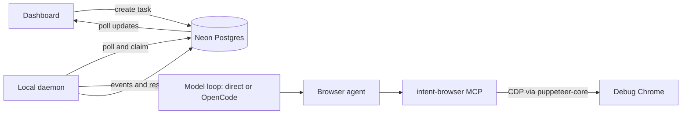

# Intent Agent

Intent Agent turns a plain-English request into a queued task that runs in your real, logged-in Chrome. You queue tasks from a Next.js dashboard, which stores them in Neon Postgres. A daemon on your machine claims each task and runs it with an OpenCode agent. The agent drives Chrome through **intent-browser**, a purpose-built MCP server that shows the model a compact semantic tree of the page instead of raw HTML or screenshots. Each task returns a status, an activity trail, its cost and a final result to the dashboard.


## Demo


The animation above is a screen recording, shown at 3x speed, of the agent running a real task through the queue and daemon. It opens Google, types "Applied AI engineer jobs India", opens the top organic result and reads the job listings. The sign-in popup and profile picture in the recording are masked for privacy.

[Download the full 36-second demo video with sound](docs/demo/intent-agent-demo.mp4). Its dashboard and job-application scenes are recreations, and the application details in them are fictional.

## Features

| Feature | What it does |
| --- | --- |
| **Plain-English tasks** | Type what you want done ("apply to this job with my resume", "book 2:30 PM tomorrow") and it is queued from the dashboard, including from your phone once deployed. |
| **Your real, logged-in Chrome** | Tasks run in a Chrome you already use, so sites that need your sessions and cookies work without handing credentials to a third party. |
| **Semantic page tree** | The model sees only what a user can act on: `[12] combobox "Country" = "India" *`. That is about 1–3k tokens per page instead of a 20–80k accessibility dump. See [How the browser tool works](#how-the-browser-tool-works). |
| **One call per page** | The model fills a whole form step in one `act` call (every field plus the Next click), so a 3-step application takes about 5 tool calls. |
| **Works on modern widgets** | Radix/MUI/React-Select dropdowns, date pickers, shadow DOM, cross-origin iframes, rich-text boxes, hover menus, infinite lists and code editors (Monaco, CodeMirror, Ace). There are 29 patterns in a [test fixture](#robustness-test-widget-zoo). |
| **Vision only when needed** | A `look` tool sends one screenshot to a vision model when the tree can't answer (canvas, image-only UI) and returns coordinates to click. |
| **Live activity trail** | Every run records status, tool actions, findings, and the final answer. With an OpenAI model, each step appears on the dashboard as it happens. |
| **Parallel workers** | `INTENT_AGENT_CONCURRENCY=N` runs N tasks at once, each in its own tab: 3.8× throughput with 5 workers in the benchmark. |
| **File attachments** | Attach files to a task, and the agent can upload local files (such as a resume) into web forms. Uploads are restricted to allowed folders. |
| **Follow-up in the same session** | Continue a finished task and the agent keeps its earlier context instead of starting cold. |
| **Approval gate** | Tick "Ask before the final submit" and the agent does all the preparation, stops one step before the irreversible action, and waits. Approve or reject from the dashboard and it resumes in the same session. |
| **QA mode** | Point the agent at a product you are allowed to test and it reports findings as structured data (severity, category, URL, repro steps, expected vs actual). |
| **Batch runs from a spreadsheet** | Upload a .csv or .xlsx and a `{{column}}` instruction: one task is queued per row. Rows that repeat an earlier key are skipped. |
| **Task templates** | Save a prompt once and reuse it from a dropdown. |
| **Structured output** | Describe the JSON you want back and get it parsed and stored with the task. |
| **Cost and model per run** | Every run records the model used and its fresh, cached and output tokens and dollar cost, summed across all steps. |
| **Safe for unattended runs** | A stuck run is aborted after 3 minutes without browser progress; long runs that keep working are not cut off. The fallback model continues in the same session without repeating finished steps. The daemon restarts a crashed debug Chrome, and you get an email when a task fails, gets blocked, or the browser is unavailable. See [Unattended runs](#unattended-runs). |
| **Personal context** | Private Markdown files in `context/` (profile, resume variants, preferences) are loaded into each new session, so the agent does not need to be told the same things twice. |
| **Stops when stuck** | On a CAPTCHA, OTP, login challenge, or input it cannot determine, the run ends as `needs_attention`, uploads a screenshot, and emails you. |
| **Consequence policy** | Browsing, reading, and filling in forms are automatic. Submitting, sending, paying, or deleting only happens when your task explicitly asks for it. |
| **Untrusted-page defense** | Text on web pages is treated as data, never as instructions, which limits prompt injection from the sites the agent visits. |
| **Private by design** | The hosted app only stores tasks and results. Browser control stays on your machine, and access is gated by a shared secret. |

## Who it is for

| You are... | Typical use |
| --- | --- |
| **A job seeker** | Search roles, read postings, and fill application forms with the right resume attached, stopping before Submit for your review. |
| **A developer or power user** | Delegate repetitive browser chores such as checking a dashboard, collecting details from several pages, or verifying a deployed page. |
| **Someone away from their computer** | Queue a task from your phone and let your home or work machine do it. |
| **A SaaS founder, product manager, or QA engineer** | Test your product the way a new user meets it: start from a search, land on your site, sign up, and use it. Run many personas as a batch in QA mode and get their findings back as structured data. |
| **An automation tinkerer** | Extend the agent with your own context files, models, and prompts, or reuse `packages/browser-mcp` in any MCP client. |

It is built for one person driving one machine, not for teams.

## When to use it

Use Intent Agent when:

- The task is a multi-step web workflow that a person would do in a browser: search, open, read, fill, upload.
- The site requires you to be logged in, or blocks headless scrapers.
- You want a fresh-eyes usability pass on a product you own or are authorised to test.
- You want a record of what the agent did and the ability to step in when it is stuck.
- You are fine with the agent working on your machine while it is on and awake.

Reach for something else when:

- You need high-volume or scheduled scraping. A few tasks can run in parallel, but each one is a model-driven browser session, so a purpose-built scraper or API will be faster and cheaper.
- A site offers an official API. An API is more reliable than driving a page.
- The action is irreversible and you have not reviewed it. The agent is designed to stop short, but you should still read what it did.
- Several people need separate accounts and permissions. Access is a single shared secret.
- You need repeatable regression testing. Exploratory runs are not deterministic, so keep a scripted end-to-end suite for release gates and use this to find what the scripts do not cover.
- The site's terms forbid automation. Check them before pointing the agent at it.

## How it works



1. You submit a task in the dashboard. It is stored as `queued`.
2. The daemon polls `/api/tasks/next`, which claims one task atomically (`FOR UPDATE SKIP LOCKED`), so several daemons never take the same task.
3. The daemon starts a session with the `browser` agent (prompt and limits in `opencode.jsonc`), prepends your `context/` files, and sends the task. OpenAI models run in the daemon's own model loop; other providers run through OpenCode (see [Engines](#engines)).
4. The agent calls intent-browser tools: `open`, `state`, `act`, `tabs`, `look`. The MCP server talks to Chrome over the DevTools Protocol on port 9222.
5. The daemon reads the whole turn back (every tool call and reasoning step, plus token usage and cost), classifies the ending, and reports it. The ending is one of: completed, `NEEDS_ATTENTION:`, awaiting approval, or failed.

The web app never controls the browser. Browser access stays on the machine running the daemon.

## How the browser tool works

`packages/browser-mcp` is the part that decides speed, cost and reliability. General-purpose browser MCP servers send the model the full accessibility tree or a screenshot on every step. That is tens of thousands of tokens, and it gives no help with custom widgets. intent-browser does three things instead.

### 1. A semantic tree, not the DOM

An in-page script ([extract-src.ts](packages/browser-mcp/src/extract-src.ts)) walks the DOM, including shadow roots and every frame. It keeps only the elements a user can act on and prints each on one line:

```text
PAGE "Application form | Northwind Careers" http://localhost:4545/apply/sde1/form
ERRORS: "Please fix 2 field(s) below."
## Personal details
[1] textbox "First name" * = "Shikhar"
[2] textbox:email "Email address" * = "" (INVALID: Email address is required)
[3] select "Country code" * = "Select…" options: +1 United States | +44 United Kingdom | +91 India …
[4] combobox "City" * = ""
[5] file "Resume" * = "" (hidden input: use upload)
? "Are you currently based in India?"
  [6] radio "Yes" ( )
  [7] radio "No" ( )
[8] button "Next"
(44 header/nav/footer links hidden; call state with all=true only if you need them)
```

- **Labels are resolved the way a person reads them:** `aria-labelledby`, `aria-label`, `<label for>`, a wrapping label (without the text of controls inside it), placeholder, or nearby text. A trailing `*` counts as required.
- **Values and state are shown inline:** current value, checked/selected, disabled, read-only, `aria-invalid` with its error text, and open popups.
- **What is blocking comes first:** a modal dialog hides everything behind it until it closes, so the model can't click through it. Open dropdowns and popovers are listed first. `role=alert` text appears as ERRORS, and toasts and `role=status` text appear as MESSAGES.
- **Clickable divs are detected:** React/Vue elements with no role are found by their pointer cursor, taking the outermost element that has it. CSS hover-only menus are detected too.
- **Clutter is collapsed:** header, nav and footer links are hidden unless asked for. Code editors appear as one `code` item.
- **Ids stay stable:** an element keeps its id for as long as it exists. Each document has a generation token, so a stale id from a previous page is refused instead of hitting a different element. Iframe ids are offset (100001, 200001, …).

### 2. Batched, verified actions

`act` takes a list of `{do, id, value}` actions and returns the new state, so one call fills a whole page. An action can target `label` instead of `id`. It is resolved on the live page when it runs, so fields that only appear after an earlier click (a tab, an accordion, a menu, the next step of a form) can be handled in the same call. Clicks by label need an exact, unique match; ambiguity is an error, never a guess. The verbs are: `click`, `fill`, `select`, `check`, `uncheck`, `upload`, `press`, `scroll`, `wait_for`, `wait`, `open`, `back`, plus two fallbacks, `click_text` and `click_at`. Each verb knows how real sites behave:

- **fill** types the text as one trusted input event and sends the last character as a real key press, so keyup-filtered autocompletes and input masks see it. It then reads the value back. Date, time and range inputs are set natively. On a read-only date field, `fill` with `YYYY-MM-DD` drives the calendar popup itself: it opens the popup, pages to the right month and clicks the day. Code editors are filled through their own API (Monaco `executeEdits`, CodeMirror `setValue`/`dispatch`, Ace), so auto-indent can't corrupt the code.
- **select** handles native selects (and waits up to 6s for options that load late) and custom dropdowns: open, type to filter if it's an input, pick the closest option by label, value, time ("2 PM" = "14:00") or words. It works on Radix (opens on `pointerdown`), MUI (portal plus backdrop) and React-Select (options are plain divs).
- **click** first checks what is under the element's centre. If a sticky header, chat widget or banner covers it, it tries other scroll positions, then reports what covers it. It never clicks an ad by accident. A hidden styled checkbox is clicked through its label.
- **Type guards** refuse nonsense such as `select` on a button or `fill` on a checkbox, and say what the element actually is.
- **Batch safety:** after any click, the page is re-read. If a dialog opened, the page navigated, or an element a later action targets changed, the rest of the batch is skipped and the model re-plans with fresh ids. A stale or briefly covered element is retried once, but only when exactly one element with the same kind and label exists.
- **Settling:** after a click, it waits for `readyState`, network idle and a quiet DOM, then re-checks for client-side redirects, for example after a saved-login check.
- **Tabs and dialogs:** `target=_blank` tabs are followed. The tool returns to the opener when a sign-in popup closes. `alert`/`confirm` dialogs are accepted and reported as notes.
- **Loop guards:** the third identical batch is refused, and the agent has a 60-step cap.

### 3. A fallback ladder instead of retries

When an action doesn't work, the agent prompt tells the model to climb this ladder instead of repeating it:

1. **state** again, because ids may have changed.
2. **`click_text`** with the visible wording, for elements the tree missed.
3. **`look`**: ask a vision model a specific question and `click_at` the x,y it returns.
4. **`NEEDS_ATTENTION`**: stop and ask the user.

`look` exists because OpenCode drops image tool results in this environment. The tool therefore makes the vision call itself (OpenAI Responses API, `gpt-6-luna` by default) and returns text plus coordinates in CSS pixels.

## Benchmarks

All numbers below come from the scripts in `bench/`, run through the daemon's own code path against local fixture sites. No real accounts or submissions are involved.

### Model and tool comparison (job application)

`bench/run.ts` runs one realistic application journey: cookie dialog, Apply opens a new tab, guest sign-in, then a 3-step form with a custom combobox, hidden file input, styled checkboxes and validation, then submit. It scores the 18 fields the fixture server actually received.

| Config | Result | Time | Tool calls | Cost |
| --- | --- | --- | --- | --- |
| **intent-browser + gpt-6-luna (low), direct engine** | **18/18, submitted (6 of 6 runs)** | **20–26s** | 7 | **$0.001** |
| intent-browser + gpt-6-luna (low), through OpenCode | 18/18, submitted | 42–75s | 9–15 | $0.002–0.004 |
| intent-browser + gpt-6-luna (none / medium), through OpenCode | 18/18, submitted | 58–63s | 9–11 | $0.002–0.003 |
| intent-browser + gpt-5.4-mini | 18/18, submitted | 88s | 17 | $0.030 |
| intent-browser + gpt-4o-mini | not submitted | 276s (hit the step cap) | 59 | $0.078 |
| intent-browser + gpt-4.1-mini / gpt-5-mini / gpt-5.4-nano | not submitted | 57–83s | 11–15 | $0.008–0.016 |
| chrome-devtools-mcp + gpt-4o-mini (previous tool) | not submitted | 92s | 14 | $0.013 |

`gpt-6-luna` is the default: it is the only model that finished every run, and it is also among the cheapest. Reasoning effort made no measurable difference. The rows other than the first were measured through OpenCode, before the direct engine existed.

### Speed work (complex task)

`bench/zoo-agent.ts` gives the agent one natural-language task covering about 20 awkward widgets on one page: portaled dropdowns, a calendar, iframes, a hover menu, an infinite list, slow content and more. It is scored on 25 checks, including two actions it must *not* take.

| Change | Time | Tool calls | Cost |
| --- | --- | --- | --- |
| Starting point | 215–344s | 28–45 | $0.011–0.020 |
| React-Select value shown in the state; `click_text` scrolls lazy lists; "trust the state" prompt | 111–122s | 13–16 | $0.005 |
| Label-targeted actions (reveal and fill in one call); calendar driven by `fill`; `click_text` matches `aria-label` | 68–91s | 6–9 | $0.003 |
| Direct engine (the daemon runs the model loop itself, no OpenCode) | **28–41s** | **3–6** | **$0.001–0.002** |

All of these runs scored 25/25. What the traces showed:

- **Model steps dominate.** Each model step takes about 3–5s, while browser work for the whole task is under 25s. The changes above cut the steps, mostly by removing retries caused by the tool under-reporting what had worked.
- **Covered Chrome windows stall every action.** When another app covers Chrome, Chrome stops rendering the page (`visibilityState: hidden`, no `requestAnimationFrame`). Puppeteer's `click()` waits on an IntersectionObserver, so every click hung until the 60s CDP timeout. intent-browser now enables focus emulation on every tab it works in, and Chrome is launched with the anti-throttling flags.
- **Extensions cost about 1.5s per navigation.** With a copied everyday profile (about 30 extensions), the median navigation took 1,602ms, against 87–145ms without extensions. The launcher now uses `--disable-extensions`; logins still work because they live in cookies.
- **Waiting for "network idle" was waiting on analytics.** Settling now only counts document, XHR/fetch, script and stylesheet requests, and ignores anything open longer than 1.5s.

### Engines

For OpenAI models the daemon runs the model loop itself (`apps/daemon/src/direct.ts`) against the Responses API and calls intent-browser over MCP. Other providers, and follow-ups to sessions that started in OpenCode, still go through OpenCode. On the same complex task and model:

| | Direct engine | Through OpenCode |
| --- | --- | --- |
| Time | 28–41s | 86–105s |
| Output tokens | about 1,000 | about 3,300 |
| Cost | $0.001–0.002 | $0.003–0.004 |
| Steps on the dashboard | Each one as it happens | After the run finishes |
| Tool start-up | Once, about 3s, kept alive between tasks | Per server start |

Two things only showed up once the loop was ours. The model has no clock, so the engine tells it today's date (without it, "the 15th of next month" was booked in July during October). And after a long batch the model sometimes reported items done that had failed, so a failed or skipped action is now announced on the first line of the result, and the prompt requires a final check of every requested item.

State diffs after each action were built and measured, then left off by default (`INTENT_BROWSER_DIFF=1` enables them). They saved no time, because cached input is nearly free, and cost accuracy: 4 of 6 runs were perfect with diffs against 6 of 6 without, because the full state is what the model checks its work against.

### Parallel workers

`INTENT_AGENT_CONCURRENCY=N` runs N tasks at once, each in its own tab of the same Chrome with its own tool process. `bench/parallel.ts` runs N copies of the complex task together:

| Workers | Wall clock | Task time | Throughput | All 25 checks passed |
| --- | --- | --- | --- | --- |
| 1 | 28–41s | 28–41s | 1× | 4 of 4 runs |
| 3 | 56s | 133s | 2.4× | 3 of 3 tasks |
| 5 | 59s | 225s | 3.8× | 5 of 5 tasks |

Getting background tabs to behave like the selected one took three fixes, each found with the deterministic zoo test run concurrently:

- **Focus emulation per frame.** A cross-origin iframe has its own renderer process and session, which the page's focus emulation doesn't reach.
- **Clicks sent to the frame's own session.** Chrome routes a page-level click into a cross-origin frame by hit-testing the displayed surface, which a background tab doesn't have. The click was reported done and never arrived.
- **Screenshots through CDP.** Puppeteer's `page.screenshot()` activates the tab first, so workers kept stealing the foreground from each other.

Limits: workers share one Chrome profile, so they share logins and cookies. Several tasks against the same site from one account can trip rate limits or bot detection. Tasks on the OpenCode engine still run one at a time. Background tabs run slower than the selected tab: a 25-action batch took 12s in the selected tab and 20–29s in the others, and starting Chrome with the anti-throttling flags did not measurably change that. Parallel runs were verified on one long-running Chrome; on a freshly started second Chrome, a few runs lost an input (an Enter key press, an iframe field) for reasons not yet traced, so concurrency stays opt-in.

### Robustness test (widget zoo)

`bench/zoo-test.ts` drives 29 widget patterns through the tool layer with no model, so a failure is always a tool bug. It currently passes 29/29 in about 40s, in the selected tab and in background worker tabs. The patterns include:

- Radix, MUI and React-Select dropdowns
- a read-only date picker
- shadow DOM, plus same-origin and cross-origin iframes
- contenteditable, a switch, tabs and an accordion
- a CSS hover menu and an infinite list
- slow content, a toast and `confirm()`
- a disabled-until-checked button and a button under a fixed bar
- a keyup-filtered autocomplete, `fill` on an autocomplete, an input mask and a range slider
- toggle buttons, optgroups, an input re-rendered on every keystroke, Enter-to-search, icon-only buttons and radio cards

### Real sites

- LeetCode Two Sum: the agent opened the problem, switched the Monaco editor to Python3, wrote a solution and submitted it. It was accepted (65/65 test cases) in 78s for $0.0025.
- ScheduRx: it booked the nearest free slot with a named doctor in a logged-in session, in 140s for $0.0044.

### Persona QA demo

`bench/qa-run.ts` runs one QA-mode task per persona in `bench/qa/personas.csv` against a copy of the practice site with eight planted bugs (`/qa/...`, listed in `bench/qa/bugs.json`). It reports which planted bugs each persona found, and lists the findings that match none of them as possible false positives. It then merges everything into the same report the dashboard shows for a QA batch (**Batch runs → QA mode → Report**, `GET /api/batches/:id/report`).

## Unattended runs

The daemon is built to be left alone with a queue:

| Situation | What happens |
| --- | --- |
| Model or provider hangs | Direct engine: each model request has a 2-minute limit and is retried twice, then the next model takes over. OpenCode engine: every intent-browser call writes a timestamp to `%TEMP%/intent-browser/activity.json`; after `INTENT_AGENT_STALL_MS` (default 3 min) with no activity, the session is aborted for real (`session.abort`), so it can't keep clicking in the background. |
| A long application that keeps making progress | Not interrupted. The only overall cap is `INTENT_AGENT_MAX_RUN_MS` (default 25 min). |
| A model fails or stalls | The next model in `INTENT_AGENT_MODEL` continues in the same session. It is told to re-read the page and not to repeat anything irreversible (a submit, a sent message, a booking). |
| The browser tool connection dies | The OpenCode server is restarted and the task continues once. |
| Debug Chrome was closed or crashed | Before claiming a task, the daemon checks port 9222. It restarts Chrome with `INTENT_AGENT_CHROME_PROFILE` (a separate instance; your everyday Chrome is untouched). If that fails, tasks stay queued and you get one email. |
| A task fails | It is marked `failed` with the reason, and you get an email. |
| A task is blocked (CAPTCHA, OTP, unknown answer) | `needs_attention`, with a screenshot on the dashboard and in the email. |
| The daemon itself restarts mid-task | The orphaned task is marked failed on startup, so it can be continued or re-run. |

Emails need the `SMTP_*` variables. Without them, the events are only logged.

## Repository structure

| Path | Purpose |
| --- | --- |
| `apps/web` | Next.js dashboard, task/batch/template APIs, authentication proxy, and upload endpoint |
| `apps/daemon` | Task poller, OpenCode session runner with watchdog and model fallback, Chrome auto-start, event reporting, email alerts |
| `packages/browser-mcp` | The intent-browser MCP server: semantic tree extraction, actions, vision fallback |
| `packages/protocol` | Shared task request/result types |
| `bench` | Practice job site and widget-zoo fixtures, benchmark matrix, deterministic and agent robustness tests |
| `context` | Private Markdown context loaded into new agent sessions; ignored by Git except for its guide |
| `scripts/start-debug-chrome.ps1` | Starts Chrome with remote debugging on port `9222` using a copied profile |
| `opencode.jsonc` | Browser-agent prompt, step limit, model options and MCP server configuration |

## Prerequisites

- Node.js 20 or newer and npm
- Google Chrome
- The OpenCode CLI (`npm install -g opencode-ai`); the daemon's SDK starts `opencode serve` itself
- An API key for your model, for example `OPENAI_API_KEY`
- A Neon/Postgres database
- Vercel Blob credentials only when file attachments are required
- SMTP credentials only when email alerts are required

Install all workspace dependencies from the repository root:

```powershell
npm install
```

## Configuration

### Web app

Create `apps/web/.env.local`:

```dotenv
DATABASE_URL=postgresql://...
DASHBOARD_SECRET=replace-with-a-long-random-value
BLOB_READ_WRITE_TOKEN=vercel_blob_token_if_uploads_are_enabled
```

| Variable | Required | Description |
| --- | --- | --- |
| `DATABASE_URL` | Yes | Neon/Postgres connection string used for tasks, devices, and run events |
| `DASHBOARD_SECRET` | For public deployments | Protects dashboard pages and APIs with a login cookie or bearer token; auth is disabled when unset |
| `BLOB_READ_WRITE_TOKEN` | For attachments | Lets `/api/uploads` store files in Vercel Blob |

The app creates missing tables, columns and indexes on first use.

### Daemon

Copy `apps/daemon/.env.example` to `apps/daemon/.env` (git-ignored); the daemon loads it at startup. Variables already set in the shell take precedence.

| Variable | Default | Description |
| --- | --- | --- |
| `CLOUD_API_URL` | `http://localhost:3000` | Dashboard/API origin to poll |
| `DASHBOARD_SECRET` | unset | Must match the web app when authentication is enabled |
| `DEVICE_ID` | `laptop-1` | Name shown by the dashboard device badge |
| `INTENT_AGENT_MODEL` | see `.env.example` | OpenCode `provider/model`, or a comma-separated fallback chain such as `openai/gpt-6-luna,openai/gpt-4o-mini` |
| `OPENAI_API_KEY` | unset | For OpenAI models and the `look` vision tool |
| `INTENT_AGENT_STALL_MS` | `180000` | Abort a run after this long with no browser activity |
| `INTENT_AGENT_MAX_RUN_MS` | `1500000` | Hard cap for one run |
| `INTENT_AGENT_CONCURRENCY` | `1` | Tasks run at once, each in its own tab (see [Parallel workers](#parallel-workers)) |
| `INTENT_AGENT_ENGINE` | unset | `opencode` forces every model through OpenCode; by default OpenAI models use the direct engine |
| `INTENT_AGENT_STEP_TIMEOUT_MS` | `120000` | Direct engine: time limit for one model request (retried twice) |
| `INTENT_AGENT_PRICES` | built-in table | Direct engine: JSON of `{"model":[input, cached, output]}` USD per 1M tokens, for cost reporting |
| `INTENT_BROWSER_DIFF` | unset | `1` returns only what changed after each `act` (off by default; see [Engines](#engines)) |
| `INTENT_AGENT_CHROME_PROFILE` | unset | Profile the daemon uses to restart debug Chrome; unset disables auto-start |
| `INTENT_AGENT_CHROME_PATH` | auto-detected | Chrome executable |
| `INTENT_BROWSER_CDP_URL` | `http://127.0.0.1:9222` | Chrome DevTools endpoint |
| `INTENT_BROWSER_ALLOWED_DIRS` | repo root | Folders `upload` may read files from (`;`-separated on Windows, `:` elsewhere) |
| `INTENT_BROWSER_VISION_MODEL` | `gpt-6-luna` | Model used by `look` |
| `POLL_INTERVAL_MS` | `3000` | Delay between queue polls |
| `INTENT_AGENT_CONTEXT_DIR` | `<repo>/context` | Directory containing private Markdown context |
| `SMTP_HOST`, `SMTP_PORT`, `SMTP_USER`, `SMTP_PASS` | unset | SMTP transport for alerts |
| `NOTIFY_EMAIL` | `SMTP_USER` | Alert recipient |

Model options (for example `reasoningEffort` for `gpt-6-luna`) live under `provider` in `opencode.jsonc`.

## Run locally

1. Start the dashboard:

   ```powershell
   npm run dev -w apps/web
   ```

2. Start a Chrome instance with the DevTools port:

   ```powershell
   powershell -ExecutionPolicy Bypass -File .\scripts\start-debug-chrome.ps1
   ```

   The script stops existing Chrome processes and opens the copied profile at `D:\claude-work\chrome-debug-profile`, so save work in other Chrome windows first. Chrome refuses remote debugging on its default profile, so a copy is needed to keep your logins. Once `INTENT_AGENT_CHROME_PROFILE` is set, the daemon starts this Chrome by itself when it isn't running.

3. Start the daemon:

   ```powershell
   npm run start -w apps/daemon
   ```

   To run the daemon against the hosted dashboard instead, set `CLOUD_API_URL` to its URL and `DASHBOARD_SECRET` to its secret. The daemon only makes outbound requests, so nothing on your machine needs to be exposed.

4. Open [http://localhost:3000](http://localhost:3000), sign in when `DASHBOARD_SECRET` is set, and submit a task. The device badge shows the daemon's `DEVICE_ID` while it is polling.

To try one task without the dashboard, run it through the same code path the daemon uses:

```powershell
npx tsx bench/task.ts "Open https://leetcode.com/problems/two-sum/ and tell me the problem's difficulty"
```

### Using intent-browser in another MCP client

The browser tool is a standalone stdio MCP server:

```json
{ "command": "npx", "args": ["tsx", "packages/browser-mcp/src/index.ts"], "env": { "INTENT_BROWSER_CDP_URL": "http://127.0.0.1:9222" } }
```

## Task lifecycle

```text
queued -> running -> completed
                  -> failed
                  -> needs_attention
                  -> awaiting_approval
```

`awaiting_approval` means the agent prepared a final action and is waiting for you to approve or reject it. `needs_attention` is reserved for blockers such as CAPTCHA, OTP, login challenges, or missing user input; the daemon uploads the latest screenshot and sends an email. On the direct engine, each tool call is posted to the dashboard as it starts. On the OpenCode engine, the daemon posts a status every 15 seconds with the agent's latest step and attaches the full ordered trail when the run ends, because OpenCode only exposes a message's parts once it is committed.

## Current limitations

- QA findings are the model's observations, and research on AI web-testing agents reports many false positives. Reproduce each finding before filing it.
- One task runs at a time unless `INTENT_AGENT_CONCURRENCY` is raised. Parallel workers share one Chrome profile, so they share logins, and several tasks on the same site from one account can trip rate limits.
- Canvas-only UIs and image CAPTCHAs are beyond the semantic tree. The `look` fallback helps with the former; the latter end as `needs_attention` by design.
- Closed shadow roots are invisible to page scripts, so elements inside them can only be reached through `look` and `click_at`.
- Setup scripts assume Windows and a dedicated Chrome debug profile.

## Safety

- Browser page content is untrusted data, not agent instruction authority.
- The browser agent stops before consequential actions unless the task explicitly requests them.
- `upload` only reads files inside `INTENT_BROWSER_ALLOWED_DIRS`.
- Keep the remote-debugging Chrome profile separate from a daily browsing profile.
- Never commit `.env` files, personal files under `context`, resumes, uploaded files, or credentials.
- Set `DASHBOARD_SECRET` before exposing the web app outside local development.

## Verification

From the repository root:

```powershell
npm test -w @intent-agent/browser-mcp        # state formatting, option matching, action parsing, upload sandbox
npm test -w apps/daemon                      # marker parsing, prompt building, model fallback chain
node --import tsx --test apps/web/src/lib/batch.test.ts
npx tsc -p apps/daemon/tsconfig.json --noEmit
npm run lint -w apps/web; npm run build -w apps/web
```

Browser tests need the fixture server (`node bench/fixture/server.mjs`) and debug Chrome on port 9222:

```powershell
npx tsx bench/zoo-test.ts                    # 29 widget patterns through the tool layer, no model
npx tsx bench/zoo-agent.ts openai/gpt-6-luna # one natural-language task across the zoo, scored
npx tsx bench/parallel.ts 3                  # three of those at once, each in its own tab
npx tsx bench/followup-test.ts               # direct engine: follow-up continues a session
npx tsx bench/run.ts --only luna-low         # job-application benchmark (see Benchmarks)
```
